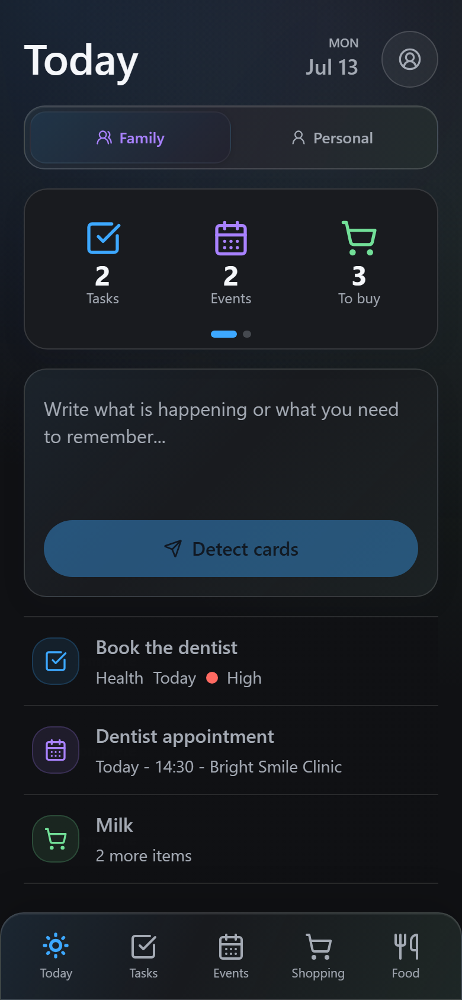
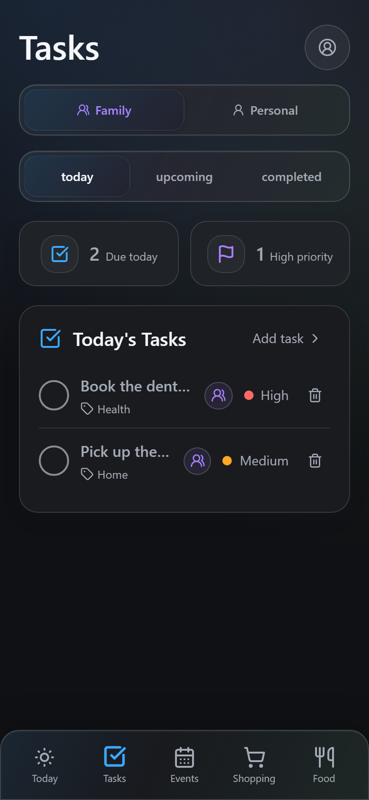
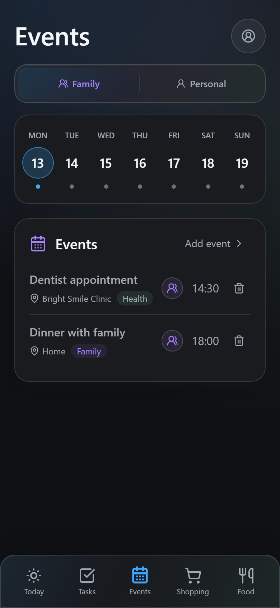
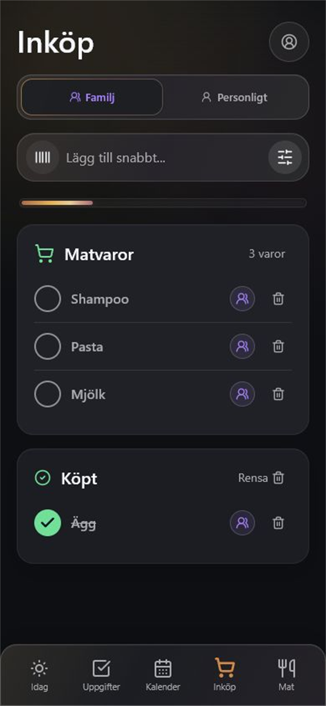
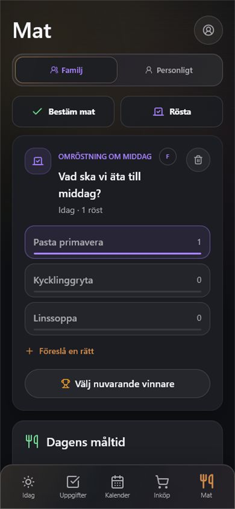
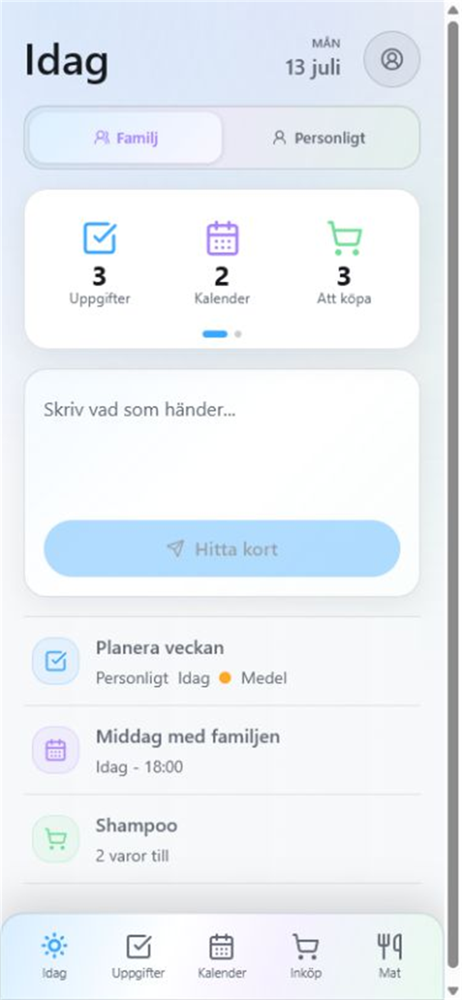
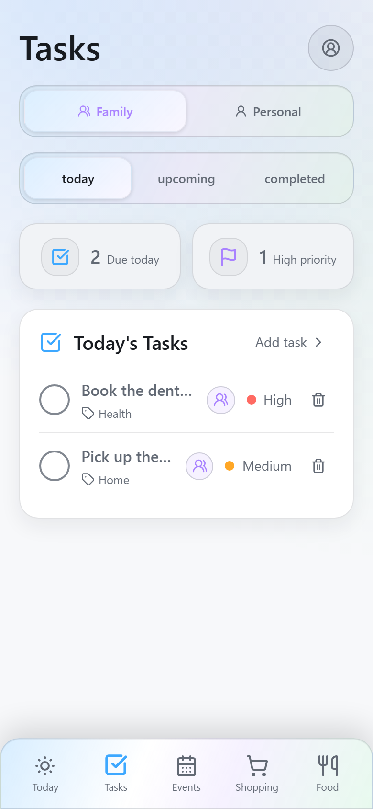
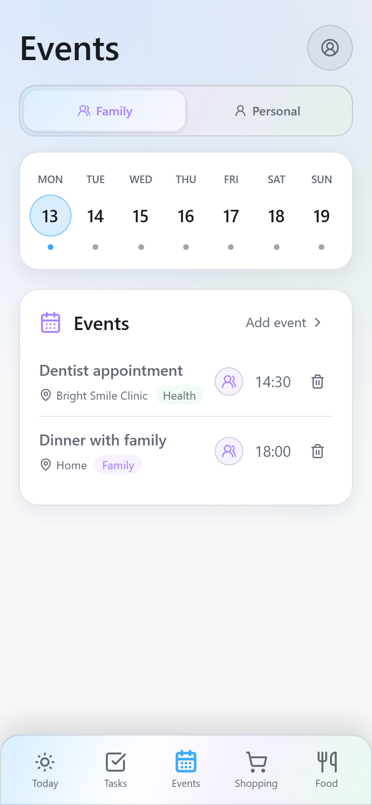
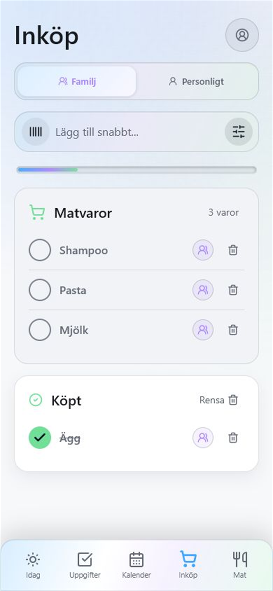
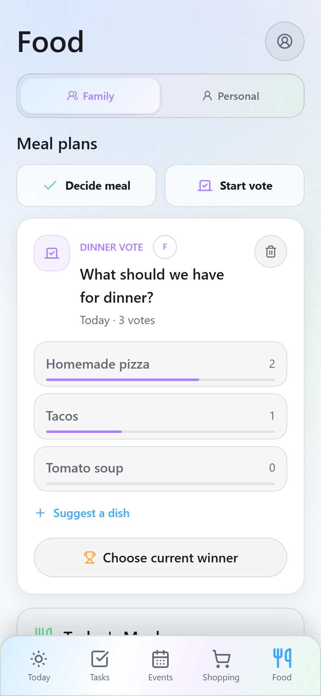

# Vardag

Vardag is a self-hosted, mobile-first family organizer for tasks, events, shopping, meals, leftovers, and shared food votes. It is an installable PWA with Swedish and English interfaces, local-first storage, Google accounts, realtime family sync, database-enforced privacy, and background assignment notifications.

> **Project status: Early beta**<br>
> Vardag is usable and actively developed, but self-hosters should expect occasional schema and setup changes before a stable release.

Each family deploys and owns its own instance. This repository does not connect to a shared Vardag service and does not include a hosted demo, production URL, Supabase project, or credentials.

## Screenshots

<p align="center">
  
</p>
<p align="center"><strong>Today</strong> brings the family's tasks, events, shopping, and quick capture into one calm overview.</p>

### App pages · Dark mode

<table>
  <tr>
    <td width="50%"></td>
    <td width="50%"></td>
  </tr>
  <tr>
    <td align="center">Tasks</td>
    <td align="center">Events</td>
  </tr>
  <tr>
    <td width="50%"></td>
    <td width="50%"></td>
  </tr>
  <tr>
    <td align="center">Shopping</td>
    <td align="center">Food and votes</td>
  </tr>
</table>

### Light mode

<table>
  <tr>
    <td width="50%"></td>
    <td width="50%"></td>
  </tr>
  <tr>
    <td align="center">Today</td>
    <td align="center">Tasks</td>
  </tr>
  <tr>
    <td width="50%"></td>
    <td width="50%"></td>
  </tr>
  <tr>
    <td align="center">Events</td>
    <td align="center">Shopping</td>
  </tr>
  <tr>
    <td colspan="2" align="center"><br><strong>Food and votes</strong></td>
  </tr>
</table>

The screenshots use synthetic local data. No real family account or hosted instance is included.

## Features

- Family and personal views across Today, Tasks, Events, Shopping, and Food.
- Google sign-in with family invite codes and member profiles.
- Assign records to the whole family, one person, or selected family members.
- Supabase RLS for personal and targeted records.
- Realtime sync and atomic completion, shopping, and food-vote operations.
- Natural-language **Detect cards** composer for Swedish and English entries.
- Recurring tasks and events with daily, weekly, biweekly, and monthly rules.
- Barcode/product-photo support for shopping items.
- Meal decisions, restricted family votes, random tie-break animation, and leftovers.
- Installable PWA with dark/light/system themes, offline shell caching, and Android/iOS icons.
- Web Push for new assignments after a device opts into notifications.

## Deploy Your Own

Vardag is intentionally a do-it-yourself project. A complete installation needs:

1. A fresh Supabase project.
2. A Google OAuth web application.
3. Your own frontend deployment.
4. Your own VAPID keys for Web Push.

Follow [SUPABASE_SETUP.md](SUPABASE_SETUP.md) for the complete step-by-step tutorial.

## Quick Local Start

<table>
  <tr>
    <th width="50%">PowerShell · Windows</th>
    <th width="50%">Bash · Linux/macOS</th>
  </tr>
  <tr>
    <td valign="top"><pre><code>git clone https://github.com/Roinur/Vardag.git
cd Vardag
npm install
Copy-Item .env.example .env.local
npm run dev</code></pre></td>
    <td valign="top"><pre><code>git clone https://github.com/Roinur/Vardag.git
cd Vardag
npm install
cp .env.example .env.local
npm run dev</code></pre></td>
  </tr>
</table>

Fill `.env.local` with credentials from your own Supabase project before testing account and family features.

## Architecture

- **Frontend:** React, TypeScript, Vite, Tailwind CSS
- **Local data:** Dexie/IndexedDB
- **Authentication and sync:** Supabase Auth, Postgres, Realtime, and RLS
- **Server logic:** Postgres RPC functions and a Supabase Edge Function
- **Notifications:** Web Push with per-installation VAPID keys
- **Hosting:** Any static Vite-compatible provider

Records store the creator separately from recipients. Personal records are readable only by their owner. Targeted family records are readable by their creator and selected recipients. Unassigned family records remain collaborative for the whole household.

## Commands

```powershell
npm run dev          # Local Vite development server
npm run dev:lan      # Development server available on the LAN
npm run build        # Type-check and production build
npm run preview      # Preview the production build
npm run test:parser  # Detect Cards parser scenarios
npm run test:i18n    # Swedish/English and UTF-8 checks
npm run test:scope   # Sharing and RLS contract checks
```

## Security Notes

- Never commit `.env.local`, Supabase service-role keys, Google client secrets, access tokens, or VAPID private keys.
- The Supabase publishable key and VAPID public key are intentionally public browser values.
- Run every migration in filename order through `npx supabase db push`.
- Treat family invite codes as invitations, not passwords.

See [SECURITY.md](SECURITY.md) for reporting guidance.

## Contributing

Bug fixes, translations, accessibility improvements, and self-hosting documentation are welcome. Read [CONTRIBUTING.md](CONTRIBUTING.md) before opening a pull request.

## Third-Party Software

Vardag uses React, Vite, Supabase JS, Dexie, Lucide, Tailwind CSS, and other open-source packages. See [THIRD_PARTY_NOTICES.md](THIRD_PARTY_NOTICES.md).

## License

Vardag is licensed under the MIT License. See [LICENSE](LICENSE).
